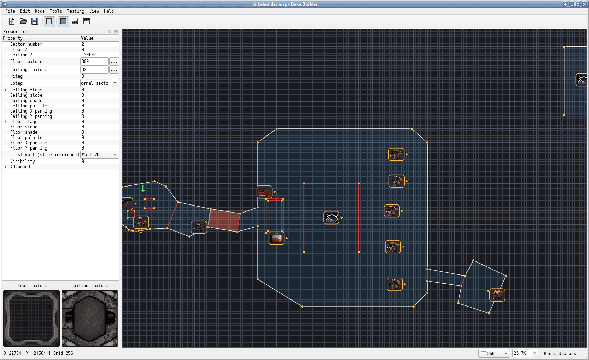

# Duke Builder

An experimental level editor for Duke 3D built with Qt.



## Requirements

- Conan 2
- Meson
- Ninja
- A C++17 compiler
- A configured and built `../libduke` checkout with its renderer enabled
- Desktop OpenGL 4.1

Create a Conan profile once if you do not already have one:

```sh
conan profile detect
```

Install the dependencies and generate the Meson native file:

```sh
conan install . --output-folder=conan --build=missing -s build_type=Debug
```

Build the libduke renderer (after its Conan dependency setup):

```sh
meson setup ../libduke/build ../libduke \
  --native-file ../libduke/build/conan_meson_native.ini \
  -Drenderer=enabled
meson compile -C ../libduke/build
```

Duke Builder statically links libduke and libduke-render from `../libduke/build`.
Both archives are required; no libduke shared libraries are needed at runtime.
On Windows, the build explicitly selects `libduke.a` and `libduke-render.a` when
present, instead of assuming MSVC-style `.lib` filenames. Otherwise it uses the
compiler's normal static-library lookup. Build both projects for the same target
architecture with compatible toolchains; renaming an archive does not make
incompatible object files compatible.
Qt's OpenGLWidgets module hosts the renderer; no Sokol window or event loop is used.

For static Qt on Linux, configuration checks whether Qt's declared dependencies
can link its hashing implementation. Only if that fails and adding `libb2` fixes
it does the build add the workaround for incomplete Qt package metadata. Windows
and shared Qt builds do not acquire an explicit `b2` dependency from this workaround.

Configure and build the application:

```sh
meson setup build --native-file conan/conan_meson_native.ini --buildtype debug -Db_sanitize=address
meson compile -C build
```

Run it:

```sh
./build/dukebuilder
```

## Shortcut help

**Help → 2D Mode Shortcuts** and **Help → 3D Mode Shortcuts** open resizable,
scrollable rich-text references. **F1** opens the reference for the current mode.
The windows can stay open while you edit; reopening one brings the same window
forward. Opening help releases the mouse in 3D. Click the viewport to resume
mouse navigation afterward.

## Checking a map

Use **Tools → Check Map** (**F4**) to run the same validation used by Save,
without writing a file. It checks exported geometry, references, field ranges,
format limits, sprite placement, and the player start. Finish or cancel any
unfinished drawing before checking.

Checking stops at the first blocking error. Choose **Show in Map** to select
and center the affected sector, line side, sprite, or player start in 2D with
its properties visible. Fix the problem and press F4 again. Map-wide errors
have no object to select. A successful check confirms that save validation
passes; it does not simulate gameplay or validate the behavior of tagged effects.
Checking does not change map data or undo history.

3D mode uses less restrictive preview validation: it retains field-range and
reference checks but permits intersecting walls and imported effect geometry.
Existing sprite sector membership is preserved for rendering. This lets maps
such as the original E1L1 enter 3D mode even when strict geometry checks fail.
Save and Check Map still apply the full validation rules.

## Autosave and recovery

Duke Builder writes a recovery snapshot every minute while there are unsaved
changes. These snapshots are separate from your `.map` files and do not change
the saved/unsaved state. They preserve unfinished drawings, untextured sprites,
and other work that cannot yet be exported as a valid Build map. Active drags
are skipped until the next interval. Both 2D and 3D edits are included; the 3D
preview's temporary player position is never stored.

After an interrupted session, startup offers **Recover**, **Discard**, or
**Later**. Recovery opens the work as an unsaved map and requires **Save As**;
it never overwrites the original automatically. Later leaves the snapshot for
a future launch. If multiple interrupted sessions exist, the newest is offered
first; recovering one leaves the others available on a subsequent launch.
Undo history and camera/selection state are not recovered.

Successful saves, successful New/Open operations, and an accepted normal close
remove the current session's recovery snapshot. Cancelling a close or failing
a save keeps it. Each running instance has its own locked snapshot, replaced
atomically. Invalid or unsupported snapshots are reported and left on disk.
Autosave write errors appear in the status bar.

Snapshots are stored in the `recovery` subdirectory of Qt's application-local
data directory (normally `$XDG_DATA_HOME/Duke Builder/Duke Builder` on Linux,
falling back to `~/.local/share/Duke Builder/Duke Builder`, and beneath
`%LOCALAPPDATA%` on Windows). No game artwork is copied into recovery files.

## Undo and redo

Use **Ctrl+Z** to undo and **Ctrl+Y** or **Ctrl+Shift+Z** to redo in either
2D or 3D. The Edit menu shows the operation that will be undone or redone.
Drawing a completed shape, dragging a selection, deleting geometry, joining
sectors, and changing properties or textures are undoable. Repeated 3D wheel
or arrow edits are grouped while the target, operation and modifiers stay the
same and successive edits are less than half a second apart.

Undo restores map data and selection in the current editing mode without moving
the camera or changing zoom. An active unfinished drawing is cancelled first.
Opening or creating a map clears history; saving retains it and marks that state
as saved. New edits after undo discard the redo branch. History retains at most
100 operations, dropping older snapshots above an estimated 128 MiB budget
(always keeping the latest operation). History is kept only for this session.

## 2D editor controls

- **Left click:** place connected wall vertices. Lines can be drawn at any angle.
- **Click the first vertex:** close the current shape and create a sector.
- **Right click or Enter:** finish the current line chain. It is kept only if its
  walls, together with existing walls, create a sector.
- **Backspace:** remove the last point from the active drawing.
- **Escape:** cancel the active drawing.
- **Middle-mouse drag:** pan the map.
- **Mouse wheel:** zoom around the cursor.
- **Zoom:** the default 100% is a level-design working scale (1024 map units
  span about 82 pixels). Use the status-bar zoom selector to return to 100%.
- **[ / ]:** decrease or increase the snapping grid size, also selectable in the
  status bar. Sizes range from 1 to 4096 map units; the default is 256 (about
  20 pixels at 100% zoom). The drawn grid uses this same spacing at every zoom;
  every eighth line is brighter for orientation.
- **G or the Grid toolbar button:** show or hide the grid.
- **F11 / View → Reorient Grid to Line:** with one line selected, rotate the
  nearest grid axis parallel to it. Drawing and vertex-insertion snapping follow
  the rotated grid; its origin and spacing stay unchanged.
- **F12 / View → Reset Grid Orientation:** restore the default grid axes.
- **T:** enter Sprites mode.
- **Lines mode:** select one or more lines and press Delete to remove them.
  Connected selected lines collapse onto their lowest-numbered endpoint, keeping
  the remaining sector boundaries closed. Surviving sectors retain their
  properties and relative order. Sectors collapsed below three edges disappear.
- **Vertices mode:** hover over a line to preview a new vertex; double-click to
  split the line there. The preview snaps to grid crossings along the line;
  hold Alt for a free position on the line. Shared walls split on both sides.
  Right-drag selected vertices to move them: the grabbed vertex snaps to the
  active grid, including its rotation. Hold Alt to move freely. Multiple selected
  vertices move together without changing their relative positions.
- **Sprites mode:** right-click empty space to add a sprite; left-click or
  rubber-band to select; right-drag to move; right-click a sprite to choose its
  texture; Delete removes selected sprites.
- **Player start:** the permanent arrow can be selected and right-dragged only
  in Sprites mode; it has no selectable texture and is omitted from selections
  containing ordinary sprites.
- **Alt:** temporarily disable snapping while placing or previewing a point.

Drawing snaps to existing vertices before snapping to the grid. Sector fills are
shown when a chain is closed with three or more walls.

The Editor toolbar's **Floor textures** and **Ceiling textures** buttons tile
the corresponding images inside sectors. **Plain fill** restores the original
untextured appearance (the default). Missing textures use the plain fill.
These are 2D previews; selection and hover highlighting remain visible.

The Texture Browser has a category sidebar, including **All**, **Used in this
map**, and **Others** for unmapped tiles. Search accepts tile numbers, original
tile names, and aliases such as "pistol" or "pig cop"; multiple words narrow
the results together with the selected category. Double-click a tile to select it.
Used textures refresh whenever the browser opens and include both wall sides,
active overlays, floors, ceilings, and sprites.

The catalog uses the original Atomic Edition
[tile definitions](https://github.com/videogamepreservation/dukenukem3d/blob/master/source/NAMES.H),
with categories and animation-family names added by the editor. Surface categories
also include tile IDs used on walls, floors, and ceilings in the 41 shipped
Atomic Edition maps, covering unnamed building materials. This metadata is
bundled; no game archive is needed to build the catalog. Original tiles
without a known name or family remain searchable by number in Others. Custom
GRPs may replace the artwork at those IDs, so names describe the original game.

To add a neighboring sector, draw from existing boundary vertices and reuse a
complete boundary edge, or finish an open chain between existing vertices with
Enter. Boundaries shared by two sectors automatically become two-sided walls
and appear red; outer boundaries remain light gray. Shared vertices move both
sides together. Hover and selection highlighting still apply to either kind of
wall. To join partway along an existing edge, first split it by inserting a vertex
in Vertices mode.

New rooms attached to existing sector vertices inherit that sector's floor and
ceiling heights and textures. If several sectors qualify, the first attachment point in
drawing order chooses the source, with the lowest sector number breaking ties.
Other properties are not copied, and existing rooms keep their own heights and textures.

Drawing a closed sector entirely inside another sector creates an inner loop
in the surrounding room and two-sided walls connecting the sectors. Raise the
inner floor (use a smaller Z value) to make a box or platform. Maps saved by
older versions with disconnected overlapping sectors need their topology
repaired; opening them does not automatically join intentional overlaps.

Maps containing overlapping rooms still allow drawing in non-overlapping areas:
create rooms, extend ordinary rooms, or split them between existing vertices.
Only the sectors touched by the drawing are reconstructed; unrelated rooms,
including stacked rooms, keep their geometry and properties. Drawings that affect
an overlapping sector or unsupported loops are rejected when completed, with a
status message and no change to the map. Insert vertices before drawing across
existing wall edges. Splits that would change the first wall used by a slope or
relative texture alignment are also rejected. Editing directly within stacked
rooms does not yet have a floor-selection context.

In Lines mode, select one wall to edit its texture, overlay texture, shade,
palette, texture repeat and panning, flags (`cstat`), hitag, and lotag. For a
two-sided wall, use the Properties panel's Side dropdown to choose Front or
Back, labeled with its sector number. The tick on the selected line points
toward the active side. Each side retains its own values; a one-sided wall
shows only its available side.

Sprite lotag suggestions follow the selected tile: Sector Effectors show effects,
standard enemies and supported pickups show minimum difficulty, and player
sprites show multiplayer start types. Other recognized special sprites explain
channels, sounds, waypoints, lighting phase, or speed in the lotag tooltip.
Unknown tiles keep a numeric editor. All types accept custom numeric tags;
these suggestions assume standard Duke 3D / Atomic tile definitions, which mods
can change. Changing a sprite texture refreshes suggestions without altering tags.

Sanitizers are disabled by default. The debug example above explicitly enables
AddressSanitizer; omit that flag if your development toolchain does not support it.
For a release build, use `Release` for Conan's `build_type` and a separate build
directory, explicitly disabling sanitizers:

```sh
conan install . --output-folder=conan-release --build=missing -s build_type=Release
meson setup build-release --native-file=conan-release/conan_meson_native.ini --buildtype=release -Db_sanitize=none
meson compile -C build-release
```

Existing build directories retain their configured options. Before using an
existing directory for a release, set `meson configure build-release
--buildtype=release -Db_sanitize=none` and rebuild. Switching only `--buildtype`
does not clear an explicitly enabled sanitizer.

## Opening and saving maps

Use **File → Open Map** (Ctrl+O) to open a classic version-7 Build `.map`
file. The view centers on the player start, and Save uses the opened filename.
An unsuccessful open leaves the current map intact. New, Open, and closing the application prompt to
save unsaved changes first; choose Discard to proceed without saving or Cancel
to keep editing. A canceled or failed save stops the operation, including quitting.

**File → Recent Files** lists the ten most recently opened or saved maps,
newest first, and remembers them between sessions. Select a path to reopen it,
or use **Clear Recent Files** to clear the list. Reopening a recent map uses
the same unsaved-changes prompt as Open.

Imported maps retain sector loops, independent portal-side properties, sprites,
and player start information. Connected inner sectors remain editable after
reopening. Overlapping single-loop sectors support line deletion without
rebuilding their faces; adding lines remains restricted. Empty inner loops remain editable without filling their interiors. Overlapping
and effect sectors still restrict structural edits. Saving applies the validation rules
below; some original effect geometry may be opened but cannot yet be saved.

Use **File → Save** (Ctrl+S) or **Save As** (Ctrl+Shift+S) to write a classic
version-7 Build `.map` file. Save remembers the filename until you start a new
map. Existing files are replaced only after validation and writing succeed.

Finish or cancel any active drawing before saving. The player start must lie
inside a closed sector, between its ceiling and floor. Sprites must have a
texture and lie inside a sector. Errors identify invalid placement, geometry,
field values, or format limits so they can be corrected in the editor.

Export preserves numeric X/Y/Z coordinates, rounds fractional coordinates to
integers, and converts degree angles to Build's 0–2047 angle range. Sector
numbers and first-wall selections are preserved; shared lines produce two
linked wall records with independent properties. Sprite and player sector
numbers are determined from the exported geometry, retaining imported sector
membership when it still matches the position. Ambiguous placement inside
overlapping sectors without a matching imported membership is rejected.

The classic limits are 1,024 sectors, 8,192 wall sides, 4,096 sprites, and texture
numbers 0–6,143, matching the original
[Duke 3D definitions](https://github.com/videogamepreservation/dukenukem3d/blob/master/source/BUILD.H).
Textures are referenced by tile number; their artwork is supplied by the game.

Configure the executable in **Settings → EDuke32**, then use
**Testing → Run in eDuke32** (F9) to test the current map. New or modified maps
are saved first; canceling or failing to save stops the launch. The executable
receives `-usecwd -nosetup -j <map directory> -map <map filename>` and runs with its own
directory as the working directory. On Windows, select `eduke32.exe`; the launcher
uses its absolute path and passes arguments directly through Qt, supporting
spaces in both the executable and map paths without a command shell.

Run geometry and map open/save regression tests with `meson test -C build`.

## 3D preview

Configure a game archive containing ART tiles and PALETTE.DAT (normally
DUKE3D.GRP) in **Settings → Game Data**. Left-click a highlighted surface or sprite to select it in orange; click it again to deselect.
**Shift+click** adds or removes a surface or sprite. A plain click replaces a
multi-selection. **Ctrl+wheel** shades the entire selection relative to each
surface's current value, as one undoable edit. Wheel height, Alt+wheel slope,
texture choice/paste, panning, scaling, and wall-scale reset also support
multi-selection. Each action validates and commits the whole batch together.
Height edits skip walls; slope edits affect only floors and ceilings. Texture
choice and paste include sprites, while surface panning/scaling skip them.
Right-click opens one texture picker for the selection; Ctrl+C still samples
the highlighted texture. Relative heights and texture offsets are preserved.
Selection survives property edits and undo/redo, but clears when returning to 2D
or when restored geometry changes invalidate its identities.
Mouse-wheel edits keep targeting the selection when you look away. Escape clears
the selection and releases the mouse. Press **Q** over the map to enter 3D,
and **Q** again to return to the same 2D view. **View → 3D Mode** also switches
views; when the pointer is outside the viewport it uses the 2D view's center.

The slim 3D status bar keeps control help on one line beside operation messages.
A separate field shows shade once: for the selected surface when present,
otherwise for the highlighted surface.
With multiple selections it shows the count and their shared shade, or “mixed”.

The camera starts at the map point under the cursor, or just inside the nearest
sector when the cursor is outside. Its height is placed between the local floor
and ceiling, accounting for slopes; its initial angle follows the player start.
Each entry renders a fresh snapshot of the current edits, without saving the map
or modifying the player start. Invalid/incomplete maps produce an explanatory
message and remain in 2D. The renderer currently uses the first configured GRP
it can render with; it does not combine multiple archives.

- **W/S:** fly forward/backward along the viewing direction, including pitch.
- **A/D:** strafe horizontally. **Shift:** move faster.
- **Mouse:** look around (captured on entry).
- **Escape:** release the mouse. **Left click:** capture it again.
- **H:** toggle surface highlighting (enabled on entry). A crosshair marks the
  aim point while captured; a cross cursor follows the released mouse.
- **Mouse wheel:** raise/lower the highlighted sprite, floor or ceiling by 1024 Build Z
  units per notch, or 128 with **Shift** held. Wheel-up raises it; wheel-down lowers it. Walls are unaffected.
  Height edits update the map, persist on return to 2D, and are saved normally.
  Changes that would invalidate the map are rejected with a status message.
- **Ctrl+wheel:** change the selected surface's shade, or the highlighted surface
  when nothing is selected. Works on floors, ceilings, wall sides, and sprites.
  Wheel-up darkens and wheel-down brightens by 1 per notch, limited to -128–127.
- **Alt+wheel:** change the highlighted floor/ceiling slope by 256 per notch.
  **Shift+Alt+wheel:** use fine steps of 16. Wheel-up
  increases the signed slope; wheel-down decreases it. Nonzero slopes enable
  the sloping flag; returning to zero clears it. Set the first wall in 2D to
  choose the slope axis. Changes that invalidate the sector are rejected.
- **Ctrl+C / Ctrl+V:** copy/paste the highlighted surface's texture tile between
  walls, floors and ceilings. Offsets, scale and other properties are preserved.
  The copied tile remains available when switching between 2D and 3D.
- **Right click:** choose a texture for the highlighted sprite, wall, floor or ceiling.
  Cancel leaves the map unchanged; mouse look resumes if it was captured.
- **Arrow keys:** pan the highlighted wall, floor or ceiling in texture X/Y
  coordinates, one offset unit per press (wrapping from 0 to 255).
- **Shift+arrows:** resize the highlighted texture. Right/Up enlarges; Left/Down
  shrinks. Walls have independent horizontal/vertical scaling. Build floors and
  ceilings support only two uniform sizes, selected with these same keys.
  Texture edits persist in the map and save normally.
- **Q:** return to 2D.

This is a free-flight preview with no collision or game simulation. The
libduke renderer's current rendering limitations also apply here.

`meson test -C build` includes camera-placement and snapshot tests. For a desktop
OpenGL integration check, run `./build/view3d-smoke /path/to/DUKE3D.GRP`; it checks
repeated Q toggles, textured frames, resizing, surface-height editing, validation
and save persistence.

## Wall texture scale

New walls use 16 horizontal map units per texture pixel (`xrepeat` is wall
length / 128, rounded and limited to Build's 1–255 range). Vertical repeat starts
at 8. Imported maps retain their stored repeats. Resizing walls preserves their
current density, including custom scales; splitting also continues texture
panning along both wall sides. Build's integer repeat/panning limits can cause
rounding differences, particularly on very short or very long walls.

Use **View → Reset Texture Scale** on the selected wall side in 2D or highlighted
wall in 3D; **R** does the same in 3D. This resets horizontal density and vertical
repeat without changing textures or offsets.

## Stick sprites to walls

In **2D sprite mode**, select a sprite and press **O**. In **3D**, point the
crosshair at a visible sprite and press **O**. The sprite is highlighted when
selected. **Tools → Stick Sprite to Wall** is also available.

The sprite snaps to the nearest wall of its own sector (including two-sided
walls), regardless of its angle. It becomes wall-aligned, faces into the room,
and sits slightly off the wall to avoid flicker. Height, texture, tags and
unrelated flags are preserved. This is a one-time placement; it does not follow
later wall movement. This intentionally differs from Build's directional
ornament command.

## Linux AppImage

The optional packaging script creates a single x86-64 AppImage, with libduke
and its renderer linked statically and the remaining redistributable runtime
libraries collected by linuxdeploy. Game data and EDuke32 are not included.

After configuring and building libduke with its renderer enabled, configure a
separate release build (the debug example above opts into AddressSanitizer):

```sh
meson setup build-appimage --native-file=conan/conan_meson_native.ini \
  --buildtype=release -Db_sanitize=none --prefix=/usr
./scripts/build-appimage.sh build-appimage
```

The result is `dist/DukeBuilder-0.1.0-x86_64.AppImage`, using the version from
Meson. An optional second argument chooses the output directory. The script
builds the project, stages only runtime installation files, bundles dependencies,
and removes its temporary AppDir after packaging. Existing artifacts are replaced
only after packaging succeeds. It requires Meson, Python 3, curl, coreutils and
binutils (`readelf` and `strip`). The first invocation downloads a pinned linuxdeploy release
with its bundled AppImage output plugin and a pinned AppImage runtime; every
invocation verifies both SHA-256 checksums.
The tool is cached in `dist/.tools`. Packaging uses extraction mode, so FUSE is
not required on the build machine. The current Conan Qt configuration links its
XCB and GLX plugins statically; a dynamic Qt build would need additional deployment
support.

For public releases, build **all dependencies, including Qt and libduke**, on the
oldest Linux baseline you intend to support, ideally in a reproducible container.
Building an AppImage on a newer distribution does not lower its glibc requirement.
The host still needs working graphics drivers and OpenGL 4.1. Test the artifact
on a clean supported desktop, including loading game data and entering 3D mode.
Users can run it with:

```sh
chmod +x DukeBuilder-0.1.0-x86_64.AppImage
./DukeBuilder-0.1.0-x86_64.AppImage
# Without FUSE:
./DukeBuilder-0.1.0-x86_64.AppImage --appimage-extract-and-run
```

The desktop entry intentionally takes no filename argument: opening maps is
currently handled through Duke Builder's File menu.

## Windows NSIS installer

The installer packaging is ready for a **future Windows x64 build**. It does not
cross-compile Duke Builder or resolve the remaining Windows build dependencies.
It uses NSIS 3 (`makensis`) and Python 3 and can run on either Linux or Windows.

Prepare a clean deployment directory, for example:

```text
windows-stage/
  dukebuilder.exe
  ...required runtime DLLs...
  platforms/qwindows.dll      # for dynamic Qt builds
  ...other required Qt plugins...
  licenses/...               # redistribution notices for bundled components
```

Put the executable at the root, not in `bin/`. Include the Windows dependencies
of the actual release build. The packaging script automatically runs
`windeployqt --release --no-compiler-runtime` on a temporary copy of this folder,
then includes the deployed Qt DLLs and plugins in the installer. Use the
`windeployqt` from the **same Windows Qt installation used to build the app**;
it is discovered on PATH or supplied with `--windeployqt PATH`. For static Qt, ensure
the Windows platform plugin is linked into the executable. Pass
`--vc-redist PATH` with Microsoft's `vc_redist.x64.exe`; the installer embeds
this package and runs it before installing or upgrading Duke Builder. Obtain it
from [Microsoft's redistributable downloads](https://learn.microsoft.com/en-us/cpp/windows/latest-supported-vc-redist)
and use a version at least as new as the MSVC toolchain used for the application
and its dependencies. The package is supplied separately from the staging folder;
no download is needed on the user's machine. Header checks do not authenticate
its publisher: use the original Microsoft-signed package.

For a build whose application and dependencies do not require the shared MSVC
runtime (such as an entirely static runtime or MinGW build), explicitly use
`--skip-vc-redist` instead and supply any other toolchain runtime DLLs yourself.
This is independent of `--skip-qt-deploy`: static Qt alone does not imply a static
MSVC runtime. Keep libduke and its
renderer statically linked. The staging folder must not contain game archives,
maps, EDuke32, debug symbols or development libraries. Users supply game data
and configure EDuke32 separately after installation.

From the repository root on either operating system:

```sh
python scripts/build-windows-installer.py windows-stage --vc-redist C:/redist/vc_redist.x64.exe --check-only
python scripts/build-windows-installer.py windows-stage --vc-redist C:/redist/vc_redist.x64.exe
```

Use `python3` on Linux if necessary. If NSIS is not on PATH, pass its compiler:

```powershell
python scripts/build-windows-installer.py windows-stage --vc-redist C:/redist/vc_redist.x64.exe --makensis "C:\Program Files (x86)\NSIS\makensis.exe" --windeployqt "C:\Qt\6.8.3\msvc2022_64\bin\windeployqt.exe"
```

Automatic deployment requires a runnable Windows `windeployqt`. To package on
Linux, first deploy the folder on Windows, then use `--skip-qt-deploy`. That option
also supports static Qt builds. Missing tools or failed/incomplete Qt deployment
stop packaging; there is no silent fallback. `--check-only` performs deployment
and validation but does not compile an installer. The input folder is never
modified, and temporary deployed files are removed after the command finishes.

The output is `dist/DukeBuilder-0.1.0-x64-Setup.exe`. The version defaults to
`meson.build`; `--version 0.1.0-beta.1` and `--output-dir PATH` override it.
The wrapper checks PE headers for x64 executable/DLL payloads, rejects Linux
binaries and invalid Windows filenames, generates an explicit installation and
uninstallation file list, and runs the compiler with warnings treated as errors.
An existing output installer is replaced only after successful compilation.
These checks cannot establish that every runtime DLL is present or that the
application runs correctly on Windows.

Installer behavior:

- Choose **current user** (the default) or **all users** on the installation-mode
  page. Defaults are `%LOCALAPPDATA%\Programs\Duke Builder` and
  `%ProgramFiles%\Duke Builder`, respectively. Shortcuts and installed-apps
  registration follow the selected scope.
- Setup requests the highest available privileges: administrators see a UAC
  prompt at startup, even when choosing current-user installation. Standard users
  install for themselves; to select all users, start setup with **Run as
  administrator**. When supplying another account's credentials, current-user
  installation refers to that account. The shared MSVC runtime may separately
  require administrator approval.
- Runtime installation failures or cancellation stop setup before removing the
  previous application. An already installed newer runtime is accepted. A required
  restart is reported without forcing a reboot; successful setup returns code
  `3010` when a restart is needed (including in silent mode). Silent mode does not
  bypass Windows elevation requirements.
- The shared MSVC runtime is left installed when Duke Builder is uninstalled.
- Windows 10 or newer, 64-bit; the application's OpenGL 4.1 requirement remains.
- Start Menu shortcuts, an optional desktop shortcut, and an entry in Windows'
  installed-apps list.
- Upgrades replace the previous installation in the selected scope, including
  older current-user releases. Current-user and all-users installations can
  coexist in separate directories; setup refuses to reuse the other scope's
  folder. Close Duke Builder before installing or uninstalling.
- Uninstall removes only explicitly packaged files and empty directories. It
  preserves user maps, game data and Qt application settings. Installer metadata
  uses a separate registry key from those settings.
- Silent setup supports `/S /CurrentUser` and `/S /AllUsers` (the latter requires
  elevation). Uninstallation supports `/S` and restores its scope from installed
  metadata, including when `Uninstall.exe` is launched directly. Do not remove
  `install-scope.ini` from the installation folder. No `.map` file association is
  registered because command-line map opening is not yet implemented.

`python3 tests/windows_installer_test.py` checks payload validation and manifest
handling without Windows. The NSIS script has also been compiled with NSIS 3.11
on Linux using synthetic test payloads; those are **not runnable Duke Builder
releases**. Before distributing a real installer, test installation, 3D rendering,
upgrades, silent mode, and uninstall preservation of user files on Windows with
no development tools installed. Release signing is a separate step and is not
configured here.

## Joining sectors

In **Sectors mode**, select the sector whose properties you want to keep, then
Shift-click additional adjacent sectors. Choose **Tools → Join Sectors** or press
**J**. The selection must be connected through shared two-sided walls.

Shared boundaries are removed; the resulting sector takes all sector properties
from the first selected sector. Surviving boundary walls retain their own side
properties, including links to unselected neighbors. Inner sectors can be joined
into their surroundings; unselected holes remain. Sprite and player-start sector
references are remapped without changing their positions. The resulting sector
remains selected. Sector numbers after removed records may change.

When several sectors are added in one selection-change event, sector number is
the tie-breaker. Click the desired source first to make the property choice
explicit. Disconnected or branching boundaries are rejected without changing the
map. If the source first wall would disappear and is needed for a slope or
relative texture alignment, choose a surviving outer first wall before joining.
The source heights replace those of the other selected sectors; check player and
sprite placement afterward. A source slope that crosses the opposite surface in
the enlarged sector is rejected.

## Deleting sectors

In **Sectors mode**, select a sector (Shift-click to select more) and press
**Delete**. This removes the selected sector interiors and their sprites.
Boundaries still used by neighboring sectors remain, with those neighbors' wall
properties intact, and become one-sided solid walls. Deleting an inner sector
therefore leaves a void hole in its surrounding sector; it does not fill the hole
or merge the two sectors. The result saves and reloads as a sector with inner loops.

The player-start marker is retained. If its sector was deleted, move it into a
remaining sector before saving. Maps containing void holes remain editable: continue drawing rooms and platforms,
splitting surrounding sectors, or editing and deleting boundary edges. Empty
interiors remain empty through these edits and through saving and reopening.
You can also draw a separate room inside a void without filling the space around
it. Restrictions on overlapping or effect geometry still apply.

In **Vertices mode**, **Delete** removes selected vertices and reconnects their
neighboring walls, including both sides of a shared wall midpoint. Each surviving
sector side uses its incoming wall's properties. Sector properties and loops are
preserved. Junctions with more than two incident walls, loops reduced below three
vertices, intersecting/inverted boundaries, and changes to a first wall needed by
slopes or relative texture alignment are rejected without changing the map.

Sprites display a facing arrow in every 2D mode. It follows the sprite's Angle
property (0° right, 90° down, 180° left, 270° up), while the texture thumbnail
stays upright. The arrow stays visible at a fixed screen size when zooming.
